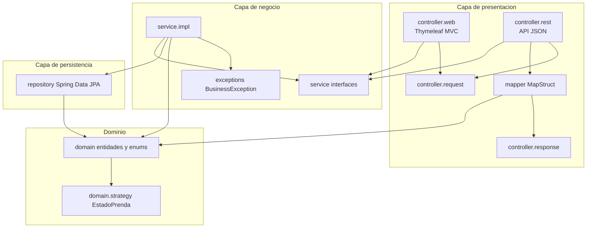

# Diagrama de capas — Tienda Ropita

Arquitectura en capas con dependencias unidireccionales.

## Responsabilidades por capa

| Capa | Paquete | Responsabilidad |
|------|---------|-----------------|
| Web | `controller.web` | Vistas Thymeleaf, formularios, redirecciones |
| REST | `controller.rest` | Endpoints JSON, validación `@Valid`, códigos HTTP |
| Servicio | `service` / `service.impl` | Orquestación, transacciones, reglas de negocio transversales |
| Repositorio | `repository` | Acceso a datos JPA |
| Dominio | `domain` | Entidades ricas, Strategy, Template Method |

## Patrones ubicados en el dominio

- **Strategy:** `EstadoPrenda` + `EstadoPrendaStrategy` — cálculo de precio de venta.
- **Template Method:** `Venta.calcularTotal()` con pasos abstractos en subclases.
- **Auditoría:** `MovimientoStock` registrado desde `StockServiceImpl` (único punto de escritura de stock).

## Separación web vs REST

Un cambio en la UI (Thymeleaf) no impacta la API REST: ambas capas dependen de las mismas interfaces de servicio, no entre sí.
