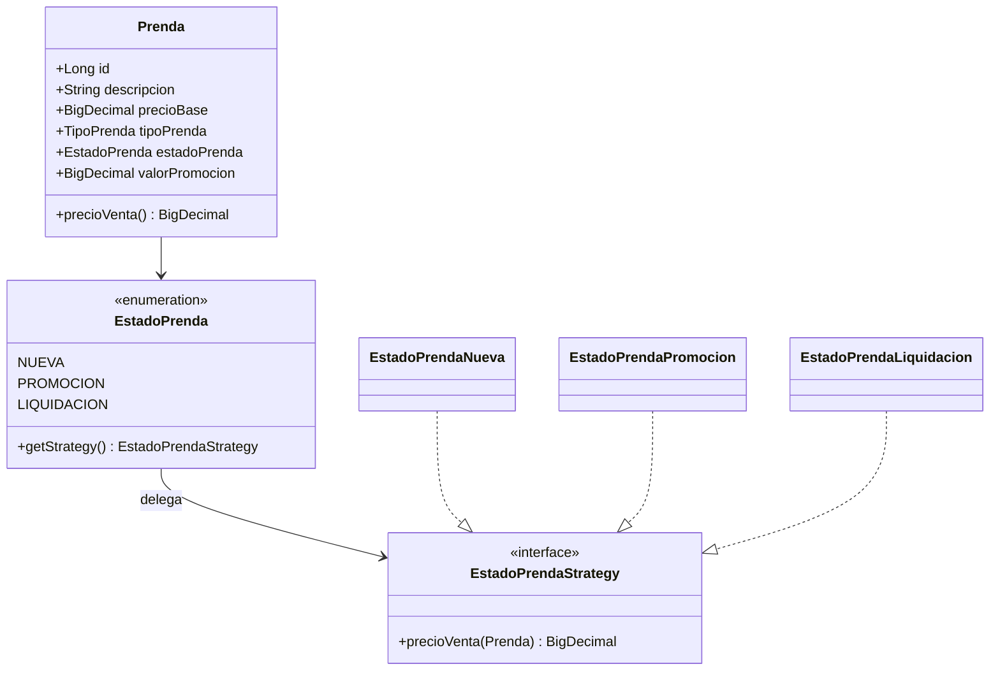
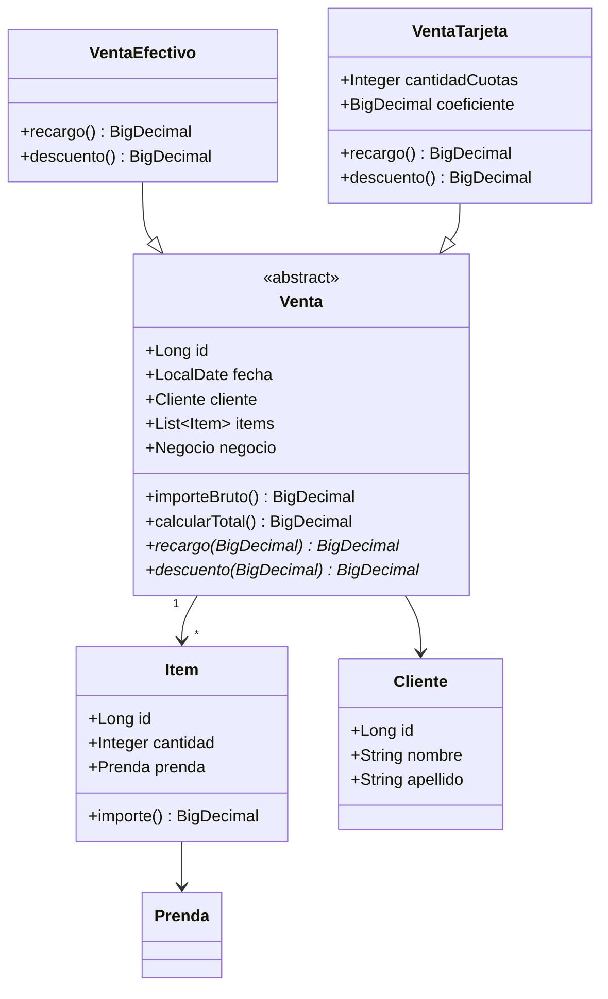
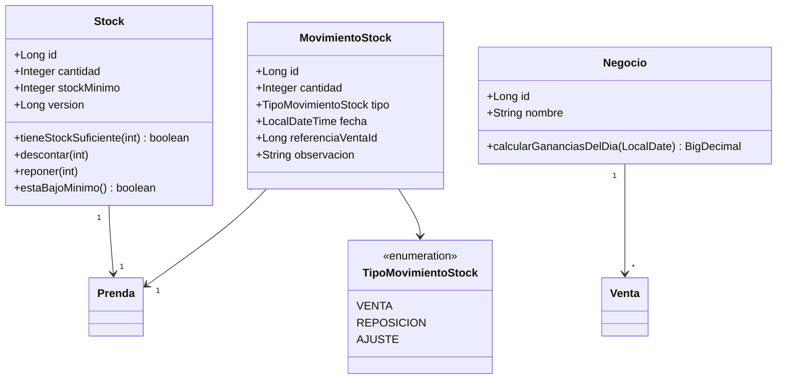

# Diagrama de clases — Tienda Ropita

## Catálogo y Strategy (EstadoPrenda)

**Patrón Strategy:** cada valor de `EstadoPrenda` encapsula su algoritmo de precio en una implementación de `EstadoPrendaStrategy`.

## Ventas y Template Method

**Patrón Template Method:** `Venta.calcularTotal()` define el esqueleto (`importeBruto + recargo - descuento`); las subclases implementan los pasos variables.

## Stock y auditoría

**Auditoría de dominio:** cada cambio de stock genera un `MovimientoStock`. `StockServiceImpl` notifica al servicio de movimientos tras cada operación (Observer simplificado).

**Concurrencia:** `@Version` en `Stock` habilita bloqueo optimista ante ventas simultáneas.
