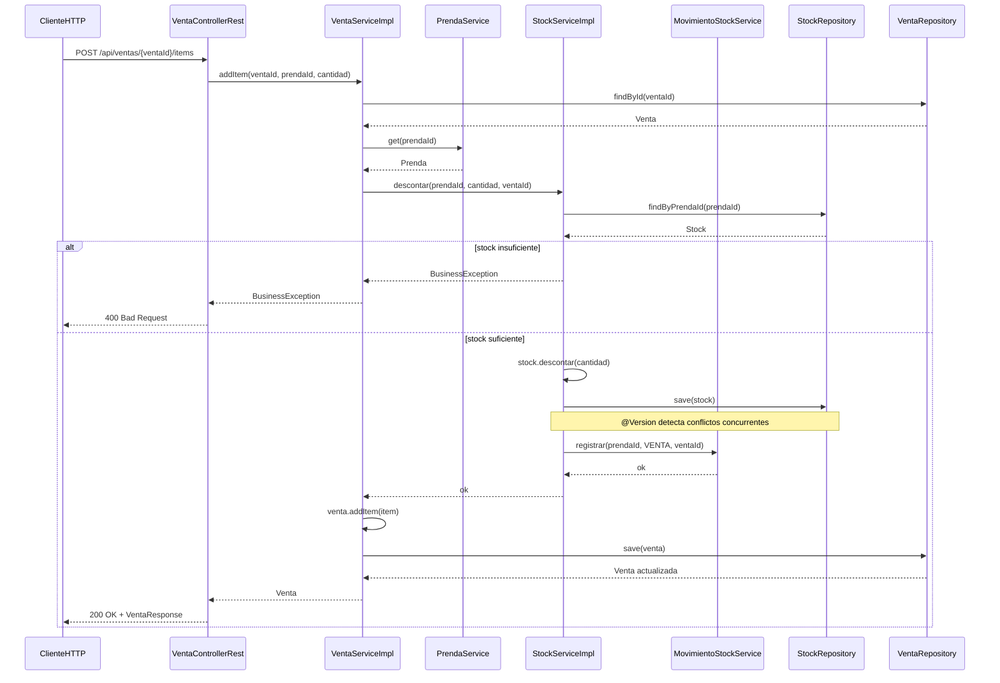

# Diagrama de secuencia — Agregar item a una venta

Flujo cuando el cliente agrega un item vía REST (`POST /api/ventas/{id}/items`).

## Escenario de concurrencia

Si dos ventas intentan descontar el último item al mismo tiempo:

1. Ambas leen `Stock` con la misma `@Version`.
2. La primera hace `save` y la versión incrementa.
3. La segunda recibe `OptimisticLockingFailureException`.
4. `GlobalRestExceptionHandler` responde **409 Conflict** con mensaje para reintentar.
